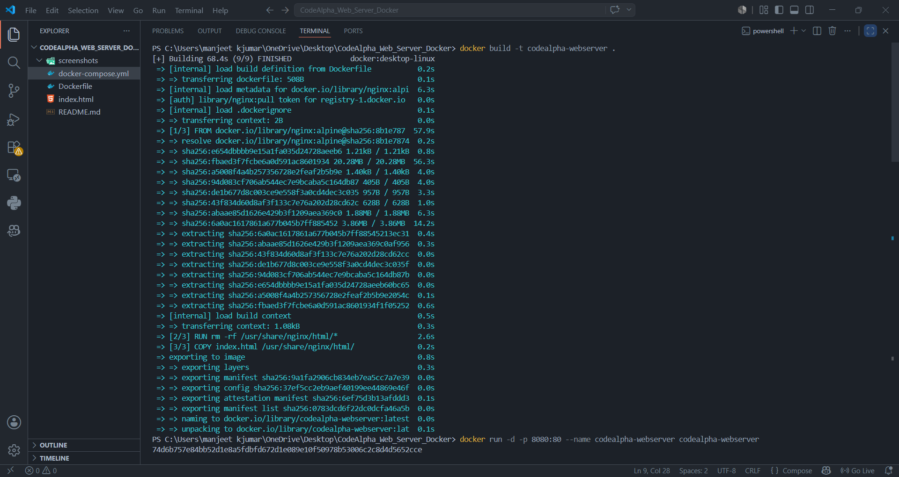
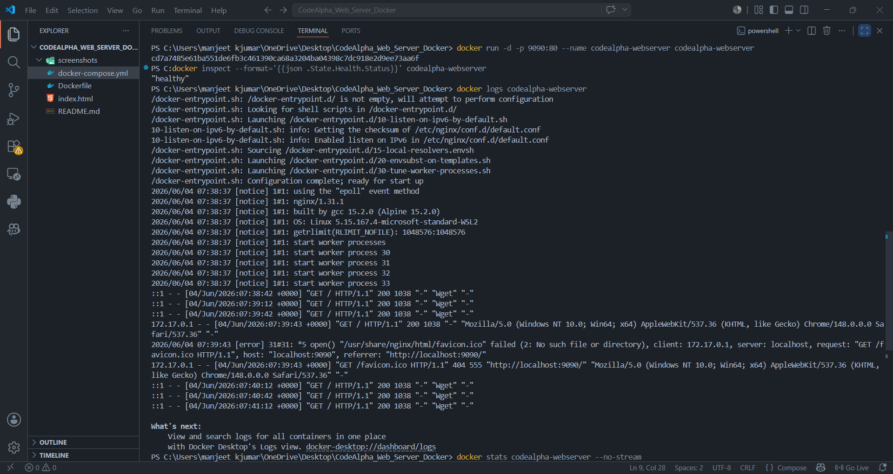
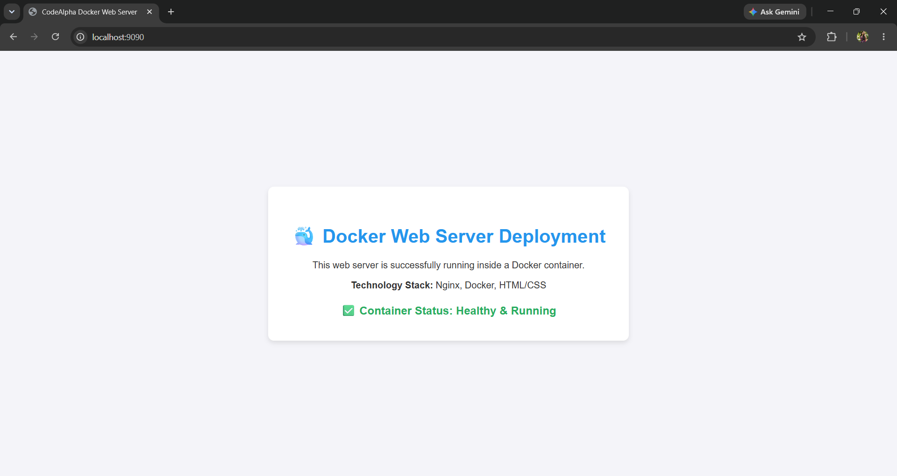

# CodeAlpha Task 4: Web Server using Docker

## 📋 Overview

This project demonstrates deploying and managing a web server inside a Docker container. The project covers the complete container lifecycle, including image creation, container deployment, health monitoring, log inspection, and troubleshooting.

The web server is built using **Nginx** running inside a lightweight **Alpine Linux** container and serves a custom HTML/CSS webpage.

---

## 🏗️ Architecture

```text
Client Browser
       ↓
Docker Container (Port 9090)
       ↓
Nginx Web Server (Port 80)
       ↓
Custom HTML/CSS Website
```

The application is containerized using Docker and exposed through port mapping from the host machine to the container.

---

## 🛠️ Tech Stack

* **Web Server:** Nginx (Alpine Linux)
* **Containerization:** Docker & Docker Compose
* **Frontend:** HTML/CSS
* **Operating System:** Linux Container

---

## 📂 Project Structure

```text
.
├── Dockerfile
├── docker-compose.yml
├── index.html
├── screenshots/
│   ├── docker_build.png
│   ├── docker_health.png
│   └── website-live.png
└── README.md
```

---

## 🚀 Container Lifecycle Commands

### Build Docker Image

```bash
docker build -t codealpha-webserver .
```

### Run Container (Manually)

```bash
docker run -d -p 9090:80 --name codealpha-webserver codealpha-webserver
```

### Verify Running Containers

```bash
docker ps
```

### Stop Container

```bash
docker stop codealpha-webserver
```

### Remove Container

```bash
docker rm codealpha-webserver
```

---

## 🩺 Container Health & Troubleshooting

As part of DevOps best practices, the Dockerfile includes a built-in **HEALTHCHECK** directive. The following commands were used to monitor and troubleshoot the container.

### Check Container Health Status

```bash
docker inspect --format='{{json .State.Health.Status}}' codealpha-webserver
```

### View Container Logs

```bash
docker logs codealpha-webserver
```

### Monitor Resource Usage (CPU/Memory)

```bash
docker stats codealpha-webserver --no-stream
```

### Verify Web Server Response via CLI

```bash
curl http://localhost:9090
```

---

## 📸 Output Verification

### Docker Image Successfully Built



### Running Container & Health Check



### Website Accessible in Browser



---

## 🎯 Skills Learned

* Docker Image Creation & Dockerfile Development
* Container Lifecycle Management (Build, Run, Stop, Remove)
* Nginx Web Server Deployment
* Port Mapping & Docker Networking
* Container Health Checks Implementation
* Docker Logging & Resource Monitoring
* Docker Compose Fundamentals
* Basic DevOps Troubleshooting

---

## ▶️ How to Run

### Method 1: Using Docker Commands

Clone the repository:

```bash
git clone https://github.com/KhushbooShah123/CodeAlpha_Web_Server_Docker.git
cd CodeAlpha_Web_Server_Docker
```

Build and run the container:

```bash
docker build -t codealpha-webserver .
docker run -d -p 9090:80 --name codealpha-webserver codealpha-webserver
```

Open in browser:

```text
http://localhost:9090
```

---

### Method 2: Using Docker Compose

Clone the repository.

Run the compose file:

```bash
docker-compose up -d --build
```

Open in browser:

```text
http://localhost:9090
```

---

## 🎯 Project Outcome

Successfully deployed a web server inside a Docker container, monitored its health, inspected logs, and managed the complete container lifecycle while following DevOps best practices.

The project demonstrates practical knowledge of Docker, container management, web server deployment, health monitoring, and troubleshooting techniques used in real-world DevOps workflows.

---

## 👤 Intern

**Khushboo Shah**
**CodeAlpha DevOps Intern**
